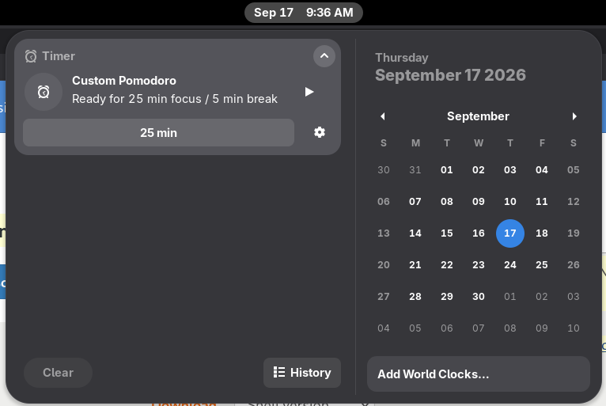
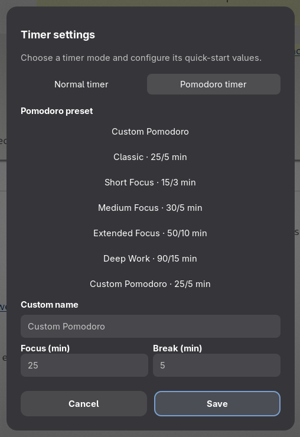
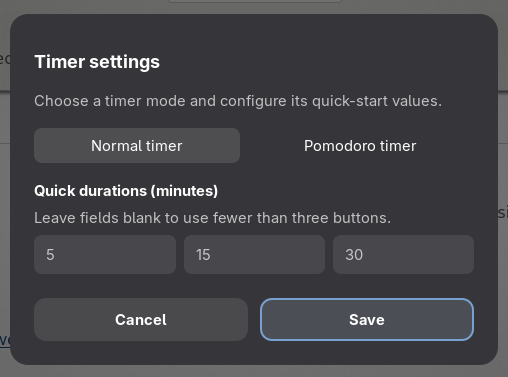

# Notification Center Timer

A simple timer in the GNOME notification center, with quick-start presets and
an optional Pomodoro mode.

## Features

- Start normal timers from quick presets, including the default 5, 15, and 30
  minutes.
- Use Pomodoro presets or create a custom focus and break cycle.
- Pause, resume, reset, and restart timers from the notification center.
- See the remaining time beside the top-bar clock while the date menu is closed.
- Configure presets and timer mode in the extension settings.

The timer is self-contained and does not control or sync with GNOME Clocks.

## Screenshots

### Timer and calendar



### Pomodoro settings



### Normal timer settings



### Top-bar countdown


## Install

This release supports GNOME Shell 50.

Install the package from `dist/`:

```bash
gnome-extensions install --force \
  dist/gnome-clocks-timer@willdo.shell-extension.zip
gnome-extensions enable gnome-clocks-timer@willdo
```

On Wayland, log out and back in if GNOME Shell does not discover the extension
immediately.

## License

GPL-3.0-or-later. See [LICENSE](LICENSE).
